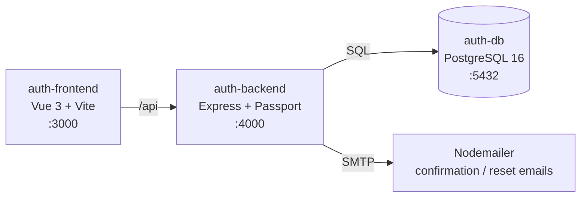

# 🔐 Auth App

Аuthentication service with email/password login, Google and GitHub OAuth, email verification, and JWT-based session management.

## 🧠 What it does

- Access/refresh token rotation, with refresh tokens stored server-side instead of just trusted client-side
- Two OAuth providers wired through the same session/token pipeline as classic email+password
- Email confirmation and email-change flows that track token expiry and pending state server-side
- Frontend, backend, and Postgres resolve each other by Docker service name, not hardcoded to `localhost`

## 🚀 Live Demo

👉 [Auth App](https://auth-app-theta-eight.vercel.app/)

## 🏅 Features

- **Email & Password Auth** - registration with hashed passwords (`bcrypt`), login, and session handling via JWT.
- **JWT Access & Refresh Tokens** - short-lived access tokens paired with stored refresh tokens (`Token` model), so sessions can be revoked server-side instead of just expiring silently.
- **Google OAuth** - sign in with a Google account via `passport-google-oauth20`.
- **GitHub OAuth** - sign in with a GitHub account via `passport-github2`.
- **Email Confirmation on Registration** - new accounts get an `activationToken`; the account isn't fully trusted until it's confirmed.
- **Email Change with Confirmation** - changing your email doesn't overwrite it immediately. It's held in `pendingEmail` behind a `confirmToken` with an expiry, and only swapped in after the link is clicked.
- **Password Reset** - request and complete a password reset via a time-limited emailed link.
- **Transactional Email** - confirmation and reset emails sent through SMTP via `nodemailer`.
- **Dockerized Everything** - Postgres, backend, and frontend each run in their own container on a shared network, with a healthcheck gating backend startup until the database is actually ready.

## 💻 Tech Stack


## 🏗️ Architecture



All three services run on a dedicated Docker network and resolve each other by container name. The frontend's dev-server proxy talks to `auth-backend` internally, while browser-facing redirects (such as the OAuth handshake) use a separate client-facing URL, since that request is resolved by the browser, not by Docker's internal DNS.

## 🪄 Installation & Setup

### Prerequisites

- Docker & Docker Compose
- Google OAuth credentials ([Google Cloud Console](https://console.cloud.google.com/))
- GitHub OAuth credentials ([GitHub Developer Settings](https://github.com/settings/developers))

### Clone the repository

```bash
git clone https://github.com/yahohulia/auth-app.git
cd auth-app
```

### Configure environment variables

Copy the example file and fill in your own values:

```bash
cp env.example .env
```

### Run with Docker Compose

```bash
docker compose up -d --build
```

### Initialize the database

On first run, the tables need to be created:

```bash
docker exec -it auth-backend node setup.js
```

> This script drops and recreates tables - run it once for a fresh setup, not on a database you care about.

The app is now available at:

- Frontend: [http://localhost:3000](http://localhost:3000)
- Backend API: [http://localhost:4000](http://localhost:4000)

### Running without Docker

```bash
# backend
cd backend
npm install
npm run start:dev

# frontend
cd frontend
npm install
npm run dev
```

You'll need a local PostgreSQL instance and matching `.env` values in that case.

## 🔒 Security Notes

- Passwords are hashed with `bcrypt` before storage - never stored or logged in plain text.
- Refresh tokens are stored server-side (`Token` table) rather than trusted blindly, so a session can be invalidated without waiting for token expiry.
- OAuth secrets and SMTP credentials are read exclusively from environment variables, never hardcoded.
